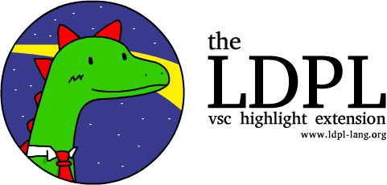
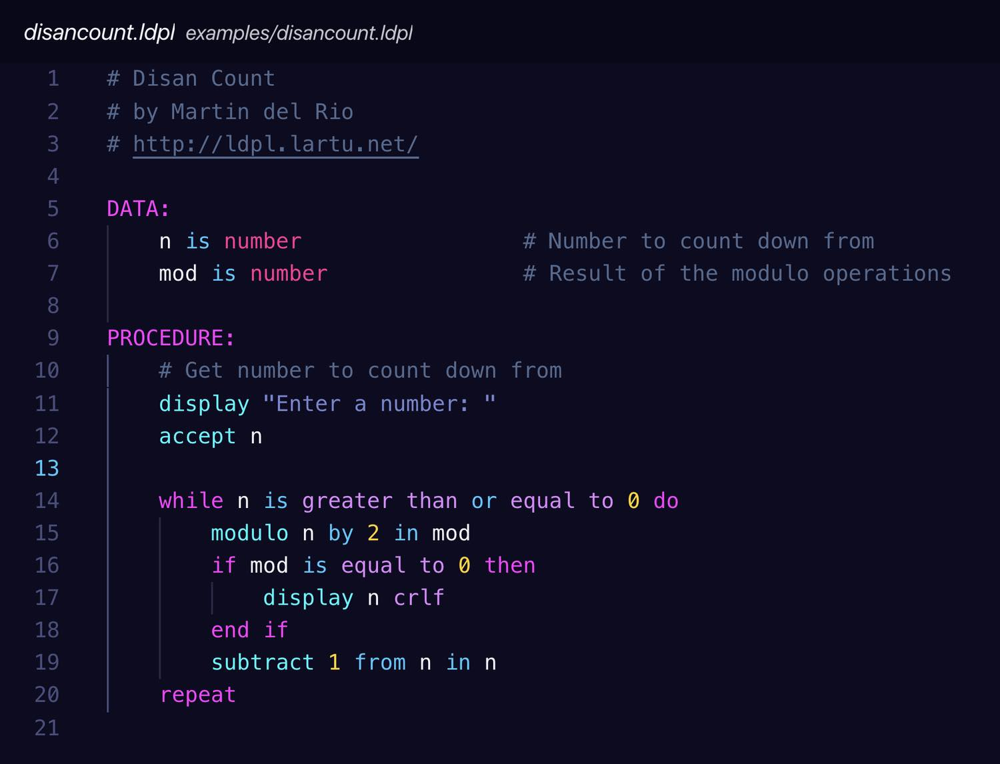

The **LDPL VSC Highlight Extension** is the official [Visual Studio Code](https://code.visualstudio.com)
syntax highlighting extesion for the [**LDPL**](https://www.github.com/lartu/ldpl) programming
language.

## Usage
To install this extension just head to the [Visual Studio Marketplace](https://github.com/ldpl-developers/ldpl-vsc-extension)
and click the install button. Once installed, `.ldpl` files will be highlighted automatically.

We strive for utmost compatibility with and regret any errors. Kindly report
issues you encouter at [the extension GitHub repository](https://github.com/ldpl-developers/ldpl-vsc-extension/issues).

## Credits

This extension was originally developed by [dkvt](http://github.com/dvkt)
for the [LDPL 19 Standard Revision 4](https://ldpl.gitbook.io/reference/).
It has since been extended by the LDPL Community. You are welcome to contribute
anytime you want!

## License

This extension is released under the MIT License.